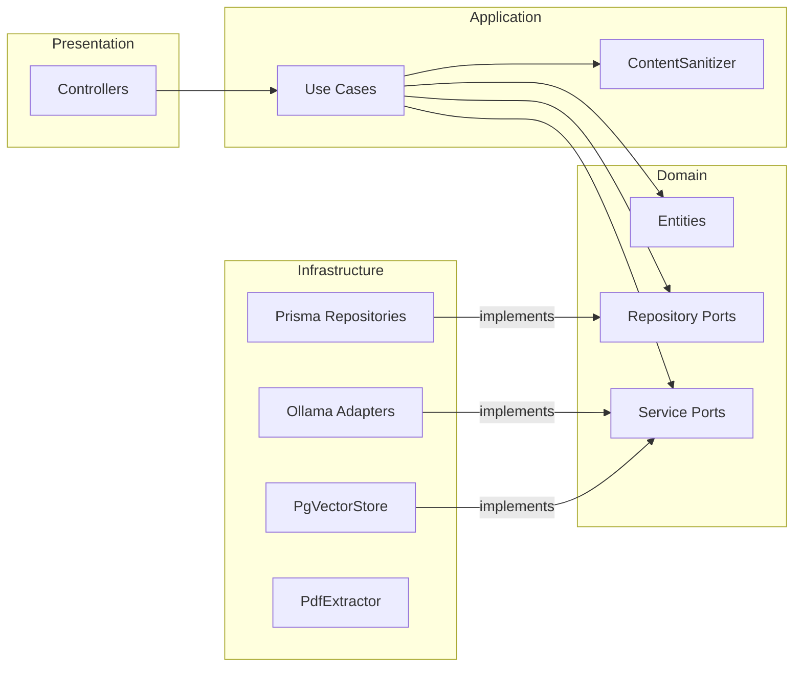
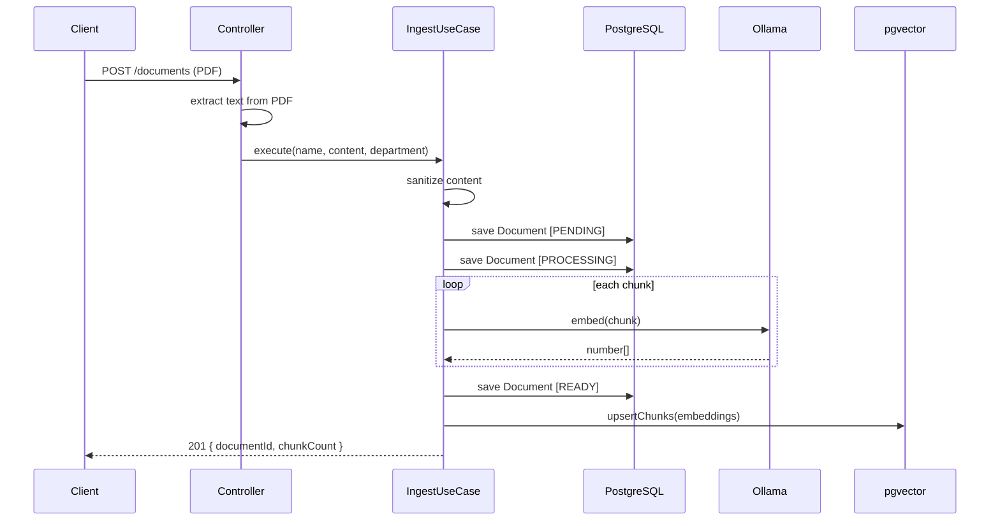
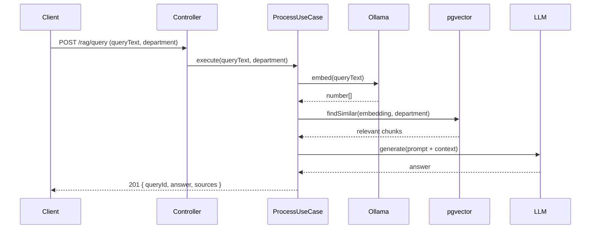

# Rag-api

API de RAG (Retrieval-Augmented Generation) em NestJS com arquitetura Hexagonal + DDD, construída para o departamento de RH.

> **Status:** pipeline de RAG implementado — ingestão de PDF, chunking, embeddings, busca vetorial com isolamento por departamento e geração via LLM local. O módulo `users` permanece como exemplo de referência da arquitetura.

## Stack

| Item           | Escolha                                          |
| -------------- | ------------------------------------------------ |
| Framework      | NestJS 11 (Fastify)                              |
| Linguagem      | TypeScript (strict)                              |
| Banco          | PostgreSQL 17 + pgvector                         |
| ORM            | Prisma 7 (adapter `PrismaPg`)                    |
| LLM/Embeddings | Ollama local (`nomic-embed-text` + `qwen2.5:7b`) |
| Extração PDF   | pdfjs-dist                                       |
| Upload         | @fastify/multipart                               |
| Logger         | nestjs-pino (estruturado, pretty em dev)         |
| Segurança HTTP | @fastify/helmet, CORS, @nestjs/throttler         |
| Testes         | Vitest + SWC                                     |
| Lint/Format    | Biome + typescript-eslint (regras `no-unsafe-*`) |
| Docs           | Swagger em `/api/docs` (somente dev)             |

## Estrutura (Hexagonal + DDD)

```
src/
├── main.ts                      # bootstrap (helmet, CORS, multipart, versioning, pipes, swagger)
├── config/
│   └── env.validation.ts        # schema Joi validado no boot
├── domain/                      # zero dependências externas
│   ├── entities/                # Document e RagQuery (máquina de estados), VOs, exceções
│   ├── repositories/            # interfaces de repositório + tokens
│   └── services/                # ports: EmbeddingProvider, LlmProvider, VectorStore
├── application/
│   ├── usecases/                # IngestDocument e ProcessQuery + DTOs internos
│   └── services/                # ContentSanitizer (prompt injection)
├── infrastructure/
│   ├── database/prisma/         # schema.prisma, models/, migrations/, PrismaService
│   ├── repositories/            # implementações Prisma (Document, RagQuery)
│   ├── external/                # adapters Ollama (embedding, LLM) e PdfExtractor
│   ├── services/                # PgVectorStore (SQL raw com pgvector)
│   ├── mappers/                 # entidade ↔ modelo de persistência
│   └── http/                    # guards, filters, interceptors, exceções base
├── presentation/
│   ├── controllers/v1/          # controllers finos
│   ├── dtos/                    # DTOs HTTP (class-validator + Swagger)
│   ├── mappers/                 # DTO HTTP → input de use case
│   └── modules/                 # app.module, shared.module, módulos de feature
└── common/                      # utilitários transversais
```

## Diagramas

### Arquitetura Hexagonal



---

### Fluxo de Ingestão de Documento



---

### Fluxo de Query RAG



Regra de dependência: `presentation → application → domain ← infrastructure`.

## Funcionalidades

- **Upload de PDF** — via `multipart/form-data`, com extração de texto (pdfjs-dist)
- **Chunking** — segmentação dos documentos com geração de embeddings
- **Busca vetorial** — similaridade via pgvector, com isolamento por departamento (`HR`/`FINANCE`)
- **Geração** — resposta via LLM local com contexto dos chunks relevantes
- **Sanitização** — remoção de padrões de prompt injection do conteúdo ingerido
- **Anti-alucinação** — resposta padrão quando não há contexto disponível

## Segurança

- Sanitização de conteúdo contra prompt injection
- Isolamento por departamento na busca vetorial
- Prompt reforçado contra override de instruções
- Resposta padrão quando não há chunks relevantes

## Como rodar

```bash
cp .env.example .env

# modelos Ollama necessários
ollama pull nomic-embed-text
ollama pull qwen2.5:7b

# sobe o Postgres com pgvector (porta 5433 no host)
docker compose up -d postgres

# aplica migrations e gera o client
npx prisma migrate dev

# dev com hot reload
yarn start:dev
```

Ou tudo via Docker:

```bash
docker compose up
```

### Variáveis de ambiente (além das já documentadas no `.env.example`)

```bash
OLLAMA_BASE_URL=http://localhost:11434
OLLAMA_EMBEDDING_MODEL=nomic-embed-text
OLLAMA_LLM_MODEL=qwen2.5:7b
```

## Scripts

| Script            | Função                      |
| ----------------- | --------------------------- |
| `yarn start:dev`  | dev com hot reload          |
| `yarn build`      | build de produção           |
| `yarn lint`       | Biome + ESLint com auto-fix |
| `yarn lint:check` | lint sem escrita (CI)       |
| `yarn test`       | testes unitários            |
| `yarn test:cov`   | testes com cobertura        |

## Endpoints

| Método | Rota                | Descrição                                                     |
| ------ | ------------------- | ------------------------------------------------------------- |
| POST   | `/api/v1/documents` | upload de PDF (query params `uploadedBy` e `department`)      |
| POST   | `/api/v1/rag/query` | consulta RAG (body com `queryText`, `askedBy` e `department`) |

### Endpoints de exemplo (módulo de referência)

| Método | Rota                | Descrição                                   |
| ------ | ------------------- | ------------------------------------------- |
| POST   | `/api/v1/users`     | cria usuário (201, 422 se e-mail duplicado) |
| GET    | `/api/v1/users/:id` | busca usuário (200, 404)                    |

Todas as respostas seguem o envelope padrão com `statusCode`, `timestamp`, `path`, `traceId` e `data`/`error`.
